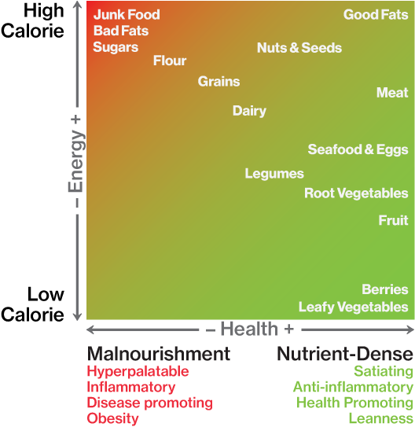

# Strava

## Pyramida potravin dle SS.fitness

1. **základní**: maso, mořské plody a vejce; zelenina
2. **podstatné**: ovoce; živočišné tuky a oleje
3. **doplňkové**: mléčné produkty, luštěniny, oříšky a semínka, celozrnné produkty
4. **chuť**: sůl, koření, houby; ocet a citrón

K omezení: cukr, kalorické nápoje, potraviny s moukou, polotovary, prefabrikáty a zpracované tuky (ztužené, palmový, apod.).
Životně důležité složky potraviny jsou poskytovány jak tradiční živočišnou produkcí, tak i rostlinnou.

Základní kritérium pro hodnocení zdravých a nezdravých potravin je hustota mikroživin, které jsou pro tělo
nezbytné, na množství energie, které potraviny poskytuje. Na příkladu sušenky a ovoce si lze snadno představit,
že ikdyž obě poskytují cukr (jako zdroj energie), tak ovoce mimo toho dává tělu i vlákninu, vitamíny, atd.

## Mikroživiny

Mikroživiny zahrnují [**vitamíny**](https://cs.wikipedia.org/wiki/Lidsk%C3%A1_v%C3%BD%C5%BEiva#Vitam.C3.ADny), [**minerály**](https://cs.wikipedia.org/wiki/Lidsk%C3%A1_v%C3%BD%C5%BEiva#Miner.C3.A1ly)
a [**organické kyseliny**](https://cs.wikipedia.org/wiki/Organick%C3%A9_kyseliny).

Vitamíny jsou nízkomolekulární látky, jež katalyzují biochemické reakce v těle. Podílejí se na metabolismu bílkovin, tuků a cukrů. Existuje 13 základních typů vitamínů.
Lidský organismus si, až na některé výjimky, nedokáže vitamíny sám vyrobit, a proto je musí získávat prostřednictvím stravy. Základní dělení je na ty rozpustné ve vodě
a v tucích.

### Přehled vitamínů

#### [A (retinol, karoten)](https://cs.wikipedia.org/wiki/Vitam%C3%ADn_A)
* **Rozpustnost**: v tucích
* **Popis**: podporuje tvorbu zrakového pigmentu používaného za nízkého osvětlení
* **Nedostatek**: šeroslepost; rohovatění kůže; snížení potence; sklon k zánětům
* **Nadbytek**: jako jeden z mála způsobuje hypervitaminózu, kdy se ukládá v játrech; způsobuje osteoporózu a otravu
* **Výskyt**: tmavězelená a žlutá zelenina a ovoce
* **Zajímavost**: velmi vysoké dávky jsou přítomny v arktických zvířatech a nejedna polární expedice se fatálně otrávila z těchto ulovených zvířat (v důsledku došlých zásob)

#### [B1 (thiamin)](https://cs.wikipedia.org/wiki/Thiamin)
* **Rozpustnost**: ve vodě
* **Popis**: působí příznivě na nervový systém a proti únavě
* **Nedostatek**: nemoc beri-beri (vyčerpanost, ztráta chuti)
* **Nadbytek**: téměř vyloučeno, je vyločován v moči
* **Výskyt**: neloupané obiloviny, maso, pivovarské kvasnice, med a ořechy
* **Zajímavost**: nemoc beri-beri se vyskytuje v místech, kde se nadměrně konzumuje loupaná rýže, bílá mouka a rafinovaný cukr

#### [B2 (riboflavin, E101)](https://cs.wikipedia.org/wiki/Riboflavin)
* **Rozpustnost**: ve vodě
* **Popis**: důležitý pro funkci kůže, očí, srdce a pro celkovou energetickou přeměnu v organismu
* **Nedostatek**: nevede k větším problémům, obecně způsobuje záněty
* **Nadbytek**: není možné
* **Výskyt**: kvasnice, játra, hovězí maso, tvaroh, kakao
* **Zajímavost**: jeho výskyt je dominantně v živočišné stravě a tedy vegetariáni musí dbát na jeho dostatečný příjem z ořechů a kakaa

#### [B3 (niacin)](https://cs.wikipedia.org/wiki/Niacin)
* **Rozpustnost**: ve vodě
* **Popis**: hraje klíčovou roli v energetickém metabolismu buňky; snižuje hladinu cholesterolu v krvi
* **Nedostatek**: nemoc pelagra (hubnutí, poruchy zažívání, demence)
* **Nadbytek**: téměř nemožné, ale projevuje se třeba zčervenáním
* **Výskyt**: pivovarské kvasnice, játra, tuňák, krůtí maso a v zelenině
* **Zajímavost**: používá se k zlepšení barvy mletého masa, kdy reaguje s hemoglobinem za vzniku barevného komplexu; u nás je zakázán pro toto použití

#### [B5 (kyselina pantothenová)](https://cs.wikipedia.org/wiki/Kyselina_pantothenov%C3%A1)
* **Rozpustnost**: ve vodě
* **Popis**: zajišťuje metabolismus sacharidů, lipidů a životně důležitých látek
* **Nedostatek** (vzácný): křeče v nohách, nechutenství, nespavost
* **Nadbytek**: velmi velké dávky mohou způsobit nespavost a průjem
* **Výskyt**: prakticky ve všech potravinách
* **Zajímavost**: nedostatek se projevuje jako burning foot syndrom, jenž byl popsán u válečných zajatců

#### [B6 (pyridoxin)](https://cs.wikipedia.org/wiki/Vitam%C3%ADn_B6)
* **Rozpustnost**: ve vodě
* **Popis**:  nezbytný pro funkci řady enzymů a štěpení glykogenu
* **Nedostatek** (vzácný): cekání víček, křeče, záněty
* **Nadbytek**: vzácný, alergické kožní reakce
* **Výskyt**: játra, maso, vejce, v některém ovoci a zelenině
* **Zajímavost**: větší dávky pomáhají léčit chudokrevnost

#### [B7 = vitamín H (biotin)](https://cs.wikipedia.org/wiki/Vitam%C3%ADn_H)
* **Rozpustnost**: ve vodě
* **Popis**: zabudovává CO2 z aminokyselin
* **Nedostatek**: změny na pokožce, nervové poruchy
* **Nadbytek**: nevolnost
* **Výskyt**: žloutky, mléko, kvasnice, játra a ledviny
* **Zajímavost**: pojmenován z německého Haut = kůže

#### [B12 (kobalamin)](https://cs.wikipedia.org/wiki/Vitam%C3%ADn_B12)
* **Rozpustnost**: ve vodě
* **Popis**: podílí se na funkci krvetvorby a správné funkci nervového systému
* **Nedostatek**: chudokrevnost, zhoršení paměti, mravenčení v končetinách
* **Nadbytek**: ukládá se do jater, kde následně může biochemicky reagovat
* **Výskyt**: vejce, mléko, maso, vnitřnosti
* **Zajímavost**: vegetariáni musí vitamín přijímat buď z doplňků nebo obohacené stravy

#### [C (kyselina askorbová, E300)](https://cs.wikipedia.org/wiki/Vitam%C3%ADn_C)
* **Rozpustnost**: ve vodě
* **Popis**: většina rostlin a živočichů si ho umí vyrobit; podílí se na syntéze kolagenu; vstřebává železo, stimuluje vílé krvinky, vývoj kostí, chrupavek a celkově růst
* **Nedostatek**: kurděje (chudokrevnost, otoky, infekce, křehnutí kostí, všedy)
* **Nadbytek** (nelze): z těla vyločován ledvinami
* **Výskyt**: šípek, rakytník, citrusy, brambory, rajčata a další ovoce a zelenina
* **Zajímavost**: dvojnásobný držitel Nobelovy ceny Linus Pauling razil teorii, že extrémní dávky jdou používat k léčení (od nachlazení po rakovinu), kdy podával dávky 200x výšší než je doporučené množství

#### [D (kalciferol)](https://cs.wikipedia.org/wiki/Vitam%C3%ADn_D)
* **Rozpustnost**: v tucích
* **Popis**: řídí hladinu vápníku a fosfátu v krvi, tedy zpevňuje kosti
* **Nedostatek**: změknutí kostí, křivice a osteoporóza
* **Nadbytek**: hyperkalcémie (může skončit smrtí), samotné sluneční záření nemůže způsobit hypervitaminózu
* **Výskyt**: tvoří se v kůži působením slunečního záření (zajišťuje až 80% příjmu); rybí tuk, játra, žloutky, mléko
* **Zajímavost**: schopnost výroby si osvojili suchozemští obratlovci asi před 300 milióny let, kdy se přesunuli z oceánu, který byl bohatý na vápník

#### [E (tokoferol)](https://cs.wikipedia.org/wiki/Vitam%C3%ADn_E)
* **Rozpustnost**: v tucích
* **Popis**: nejdůležitější antioxidant v těle; tvorba pohlavních buněk; podporuje činnost nervového systému
* **Nedostatek**: porucha vstřebání a distribuce tuků; neplodnost
* **Nadbytek**: málo toxický, nicméně zhoršuje vstřebávání vitamínu K
* **Výskyt**: máslo, mléko, buráky, sója, maso
* **Zajímavost**: ničí se tepelným zpracováním potravin a ukládá se do zásob tukové tkáně

#### [K (kobalamin)](https://cs.wikipedia.org/wiki/Vitam%C3%ADn_K)
* **Rozpustnost**: v tucích
* **Popis**: zajišťuje srážení krve; mineralizace kostí; buněčný růst
* **Nedostatek**: špatná srážlivost krve (modřiny), řídnutí kostí; u žen menopauza
* **Nadbytek**: rozpad červených krvinec
* **Výskyt**: zelená listová zelenina; některé rostlinné oleje
* **Zajímavost**: tvrdí se, že až 90% západní dospělé populace trpí jeho nedostatkem

Minerály jsou ve stopovém množství potřebné pro všechny živé organismy, jsou nutné pro funkci enzymů a jejich nedostatek způsobuje nemoci.
Nejdůležitější jsou železo, fluor, jod, kobalt, měď, hořčík, mangan a zinek.

### [Přehled minerálů](http://www.celostnimedicina.cz/mineralni-latky-jejich-zdroje-a-vyznam-pro-organismus.htm)

#### Vápník
* **Popis**: nejhodnotněji zastoupen v těle (zuby, kosti); důležitý při růstu, těhotenství a také se podílí na svalových a nervových funkcích
* **Výskyt**: lušteniny, tmavozelená zelenina, mák, klíčky, mléčné produkty

#### Hořčík
* **Popis**: reguluje srdeční rytmus a svalové kontrakce; nepostradatelný pro metabolismus enzymů; hraje důležitou roli při srážení krve; příjem hořčíku je důležitý při rychlém růstu, výkonnostních sportech a při stresu
* **Výskyt**:  zelená listová zelenina, lušteniny, semínka, ořechy, jablka, ryby

#### Fosfor
* **Popis**: stavba kostí s zubů; biochemické reakce spojené s tukem; fuknce mozku a nervů
* **Výskyt**: ryby, lušteniny, ořechy, maso, mléčké výrobky a žloutky

#### Sodík a draslík
* **Popis**: přenos nervových impulzů; činnost svalů a srdce; nadbytek způsobuje vyšší tlak a namáhání ledvin; draslík je vytlačován sodíkem, což vede k únavě a slabosti
* **Výskyt**: sodík - sůl; draslík - brambory, lušteniny, celozrnné obiloviny a ořechy

#### Železo
* **Popis**: buněčné dýchání; stavba a funkčnost hemoglobinu; zvyšuje obranyschopnost organismu a brání proti infekcím
* **Výskyt**:  vnitřnosti, lušteniny, žloutek, celozrnné obiloviny

#### Síra
* **Popis**: obsažena v bílkovinách; podílí se na detoxikaci organismu
* **Výskyt**: vejce, mléčné výrobky, luštěniny, maso a ořechy

#### Zinek
* **Popis**: štěpení bílkovin v těle; tvorba inzulinu a chrání před rakovinou; důležitý při léčbě alergií a kožních onemocnění
* **Výskyt**: dýňová semena, ústřice, klíčky, otruby a vejce

#### Selen
* **Popis**: odstraňuje volné radikály v těle (antioxidant); zásadní vliv na kardiovaskulární systém; chrání před těžkými kovy
* **Výskyt**:  kukuřice, klíčky, vejce, mořské plody

#### Křemík
* **Popis**: růst organismu, zpevňuje cévy a kosti; zdravá pleť a vlasy
* **Výskyt**: pektin, celozrnné obiloviny

#### Chrom
* **Popis**: metabolismus sacharidů, růst a obranyschopnost; je zabíjen konzumací bílé mouky a cukru
* **Výskyt**:  lesní plody, pivovarské kvasnice, ořechy, klíčky, celozrnné obiloviny

#### Jód
* **Popis**: tvorba hormonů štítné žlázy; urychluje metabolismus živin; zlepšuje mentální funkce
* **Výskyt**: jodidovaná sůl, dary moře, višně a třešně

#### Fluór
* **Popis**: zdravé zuby a kosti
* **Výskyt**: fluoridovaná voda, dary moře, černý čaj

#### Měď
* **Popis**: červené krevní barvivo; buněčné dýchání
* **Výskyt**: luštěniny, játra, ořechy

#### Mangan a Vanad
* **Popis**: mineralizace kostí, metabolismus živin
* **Výskyt**:  ořechy, borůvky, jahody, luštěniny, celozrnné obiloviny

#### Kobalt
* **Popis**: Součástí vitamínu B12; v procesu krvetvorby
* **Výskyt**: játra, celozrnné výrobky

#### Molybden a Nikl
* **Popis**: součást enzymů
* **Výskyt**: fazole, celozrnné výrobky, ořechy, kapusta

#### Germanium
* **Popis**: posiluje imunitní systém
* **Výskyt**: česnek, žen-šen

#### Bór
* **Popis**: stimuluje růst u dětí
* **Výskyt**: brokolice, švestky, ořechy

Organické kyseliny jsou slabé kyseliny rozpustné ve vodě, příkladem jsou kyselina mléčná, octová, mravenčí či citronová. V lidském těle jsou obsaženy třeba v krvi či moči.

## Intolerance a alergie

Mezi běžné alergie na jídlo patří: arašídy, vejce, mléko, ryby, sóra, měkkýši, ořechy a mouka.
Intolerance se obecně projevuje záněty, křečemi či průjmy. Zajímavostí je fakt, že přes 90% obyvatel Asie má intoleranci na mléko.

## Cholesterol a Sodík

Obecnými strašáky ve stravě jsou považovány nadměrná konzumace soli a také cholesterol v krvi. Pravdou je, že tyto látky nejsou nebezpečné samy o sobě,
ale až v situaci, kdy v důsledku civilizačních chorob (vysoký cholesterol a vysoký ktervní tlak) tělo trví jejich přítomností.

V případě vajec, která obsahují cholesterol, dokonce můžeme říct, že tělu prospívají, protože přítomnost cholesterolu v potravě nesouvisí s jeho přítomností
v krvi. To je mnohem více ovlivněno příjmem tuků a obecně životním stylem.

## Základní potraviny

### Legenda

- c nízkokalorické
- V vitamíny
- M minerály
- P protein
- F dobré tuky
- Ω omega-3 kyseliny
- f vláknina
- S škroby
- T zlepšuje testosteron
- *italikou* jsou označeny nejvýživnější potraviny

Níže zmíněný list obsahuje dostupné potraviny bohaté na živiny, vitamíny, minerály a další důležité prvky, které tělo vyžaduje. Obecně jsou preferovány potraviny v co nejmenším stupni potravinářského zpracování: např. steak vs. klobása; či ovoce vs. margotka.

#### Zelenina

- <em>Kapusta</em>cVMfT
- <em>Zelená kapusta</em>cVMf
- <em>Čínské zelí</em>cVM
- <em>Rukola</em>cVM
- <em>Špenát</em>cVMfT
- <em>Řepa</em>cVMfT
- <em>Brokolice</em>cVfT
- <em>Růžičková kapusta</em>cVfT
- ČesnekVMT
- HoubycVMf
- ChřestcVMf
- DýněcVMf
- ZelícVf
- SalátcV
- RajčecVf
- KvětákcVf
- ŘedkevcVf
- KapiecVf
- CibulecV
- PórekcV
- MrkvecV
- OkurkacV
- BatátVMfS
- ŘepacVf
- BramborVMS

#### Ovoce

- <em>Avokádo</em>Ff
- <em>Všechny lesní plody</em>cf
- <em>Kokos</em>F
- Třešeň
- Jablkof
- Banánf
- Pomerančf
- Granátové jablko
- Citrón/Limeta
- Kvajáva
- Kiwi
- Hruškaf
- Mango
- Broskev
- Ananasový meloun
- Ananas
- Švestka
- Grep
- Meloun

#### Nápoje

- Voda
- Čaj
- Káva
- Kokosová voda

#### Maso, dary moře a vejce

- <em>Losos</em>VMPFΩT
- <em>Vejce</em>VMPFΩT
- <em>Játra</em>VMPFΩT
- <em>Hovězí maso</em>VMPFΩT
- MakrelaVMPFΩT
- PstruhVMPFΩT
- SardinkaVMPFΩT
- AnčovičkaVMPFΩT
- BisonVMPFT
- ÚstřiceVMPT
- ŠkebleVMPT
- KuřeVMP
- ZvěřinaVMP
- VepřovéVMPF
- KrutíVMP
- JehněčíVMPFT
- TuňákVPΩT
- KrabMPT
- HumrMPT
- GarnátMPΩT

#### Oleje a tuky

- <em>Kokosový olej extra virgin</em>F
- <em>Olivový olej extra virgin</em>F
- Avokádový olejF
- LůjF
- MásloFΩ
- Palmový olejF
- Olej z vlašských ořechůF
- Lněný olejF

#### Koření a houby

- Nové koření
- Anýz
- Bazilka
- Hřebíček
- Kardamon
- Kajenský pepř
- Koriandr
- Skořice
- Koriandr
- Chili prášek
- Kmín
- Curry
- Fenykl
- Sušený česnek
- Zázvor
- Prášek z hořčičného semínka
- Muškátový oříšek
- Prášek z cibule
- Oregáno
- Paprika
- Petržel
- Pepř
- Červená paprika
- Rozmarýn
- Šalvěj
- Tymián
- Kurkuma
- Citrón
- Sůl
- Ocet

## Doplňkové potraviny

- AlmondsfPFT
- WalnutsF
- Macadamia NutsF
- FlaxseedsfF
- HazelnutsF
- PecansF
- Brazil NutsFT
- Pumpkin SeedsT
- Squash SeedsT
- Cocoa (Dark Chocolate)MT
- Sunflower Seeds
- Sesame Seedsf
- Cashewsf
- Pistachiosf

- Greek YogurtPF
- CheesePF
- Whole MilkPF
- Cream CheeseF
- CreamF

- Green Beansf
- LentilsfS
- PeasfS
- ChickpeasfS
- Kidney BeansfS
- Alfalfaf
- Peanutsf
- Natural Peanut Butterf
- Soybean (Tofu)Pf

- OatsS
- QuinoaS
- BarleyS
- Rye BreadS
- BuckwheatS
- Rice (Long-Grain)S
- Whole Wheat BreadS
- Corn on the CobS

- Agave Nectar
- Cane Juice
- Dextrose
- Glucose-Fructose
- High-Fructose Corn Syrup (HFCS)
- Honey
- Jam
- Malt/Maltose
- Maltodextrin
- Sauces
- Sucrose
- Sugar
- Syrups

- Aspartame
- Neotame
- Rebiana (Truvia)
- Saccharin
- Sucralose (Splenda)
- Stevia

- Coolers
- Energy Drinks
- Fruit Juice
- Low-Fat Drinks
- Milkshakes
- Pop/Soda
- Sweetened Alcohol
- Sweetened Coffee

- Canola (Rapeseed) Oil
- Cottonseed Oil
- Grapeseed Oil
- Margarine
- Partially Hydrogenated Oil
- Peanut Oil
- Soybean Oil
- Sunflower Oil
- Safflower Oil
- Trans Fats
- Vegetable Oil

- Bagels
- Biscuits
- Cake
- Candy
- Cereal
- Chocolate Bars
- Cookies
- Corn-Based Products
- Corn Chips
- Crackers
- Doughnuts
- Ice Cream
- French Fries
- Frozen Yogurt
- "Gluten-Free" Products
- Hamburgers
- Hot Dogs
- "Low-Fat" Products
- Muffins
- Pancakes
- Pasta
- Pastries
- Popcorn
- Potato Chips
- Pies
- Pizza
- Pretzels
- Waffles
- White Bread
